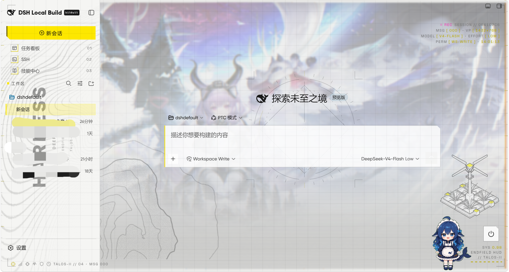

# 终末地 HUD

**给 DeepSeek Harness（DSH）Web GUI 的全息 HUD 皮肤插件** —— 工业黄黑白、战术网格、分层视差、边缘噪点。
独立插件，不并入 dsh-web 全家桶；零构建、零运行时依赖。



## 这是什么

一个把 DSH Web GUI 整体换肤的客户端插件。视觉语言取自《明日方舟：终末地》的官网界面：以 `#191919` 为底，
柠檬黄 `#FFFA00` 只留给「当前 / 选中 / 告警 / 进度」，其余靠灰阶层级与细密几何撑起密度。

它不是主题包，而是**换肤 + 动效 + 装饰层**三件套：官方 `--dsw-*` 设计 token 被整体重映射（明暗双主题各一套），
在此之上叠一层可开关的 HUD 装饰（网格 / 刻度尺 / 读数块 / 徽章 / 美术背景），
再叠一层跟随鼠标的分层视差与边缘特效。关掉开关即刻回到官方外观，不留残余。

## 亮点

| | |
|---|---|
| **全息 HUD 外观** | KV 主视觉背景 + 几何生成的 HUD 徽章 + 侧栏竖排装饰 + 右下立塔；面板半透明，让背景透出来 |
| **分层视差** | 单 rAF 循环 + 阻尼插值，按深度 d0–d3 位移并绕 XY 轴倾斜（上限 4°），带透视景深；功能 UI 也轻微跟随 |
| **边缘特效** | 只作用于背景图片层：柔化 / 模糊 / 渐隐 / RGB 通道错位（0–3 级），窗口边缘有真实噪点感 |
| **转场** | 弹层淡入、会话切换时一次扫描线掠过；机械动效统一用 `steps()` 阶跃，不做平滑过渡 |
| **明暗双主题** | 两套完整的 token 表与美术变体，随官方主题自动切换，对比度经无障碍审计 |
| **七项实时开关** | 全部即时生效、刷新不丢，不需要重启进程 |
| **性能与降级** | 无动画时不动布局；`prefers-reduced-motion` 下视差与扫描线自动关闭；样式表零 `!important` |
| **无障碍** | `:focus-visible` 焦点环、`accent-color`、对比度配对审计（12 组 × 明暗） |

## 安装

> ⚠️ **本插件尚未发布到 npm registry**，所以 `npm i` / `pnpm add dsh-client-ui-endfield-hud` 现在会 404。
> 请用下面三种方式之一从源码装。

**前置条件**

- 已安装 DeepSeek Harness，且 Web GUI 可正常启动（`dsh web`）
- `pnpm` 在 PATH 上（`dsh plugin` 的插件管理是转发给 pnpm 执行的）
- 下面的 `--profile web` 是 Web GUI 用的 profile 名；不确定就先跑 `dsh plugin --help` 看当前 profile

**方式 A · 克隆源码后 link（推荐，改代码即时生效）**

```sh
git clone https://github.com/AyanMeow/dsh-endfield-hud.git
dsh plugin --profile web add link:/绝对路径/dsh-endfield-hud
# 例：dsh plugin --profile web add link:D:\dshdefault\dsh-endfield-hud
```

**方式 B · 让 pnpm 直接从 GitHub 拉（不落一份源码到工作区）**

```sh
dsh plugin --profile web add git+ssh://git@github.com/AyanMeow/dsh-endfield-hud.git
```

> 仓库当前是 **private**，需要在有仓库权限的机器上装：本机已配好 GitHub SSH key 即可；
> 用 HTTPS 则要带上 token（`git+https://<token>@github.com/AyanMeow/dsh-endfield-hud.git`）。
> 本插件没有 `prepare`/`postinstall` 脚本，因此不会触发 pnpm 的 `allowBuilds` 拦截。

**方式 C · 本地打包 tarball**

```sh
npm pack                                        # 产出 dsh-client-ui-endfield-hud-0.1.0.tgz
dsh plugin --profile web add file:/绝对路径/dsh-client-ui-endfield-hud-0.1.0.tgz
```

**装完确认**

1. **重启 `dsh web`** —— host 半区只在进程启动时加载，不重启不会生效
2. 侧栏底部「设置」→ 出现 **终末地 HUD** 卡片
3. 卸载：`dsh plugin --profile web remove dsh-client-ui-endfield-hud`

> 重启之后，日常改样式/动效（`assets/skin.css`、`client/index.js`）只要 **刷新页面**（Ctrl+F5）即可看到，
> 不必再重启。

## 设置项

| 设置 | 范围 | 说明 |
|---|---|---|
| 启用终末地 HUD | 开关 | 关闭后立即恢复官方默认外观 |
| HUD 装饰层 | 开关 | 网格 / 扫描线 / 刻度尺 / 边缘读数 |
| 面板不透明度 | 0–100 | 装饰层的透出强度 |
| 视差强度 | 0–10 | 鼠标跟随位移 + 倾斜，0 = 关闭 |
| 背景不透明度 | 0–100 | 主视觉背景层的浓度，0 = 纯色底 |
| 鱼眼透视 | 0–100 | 背景径向畸变强度，0 = 关闭 |
| 边缘效果 | 0–3 | 柔化 / 模糊 / 渐隐 / RGB 偏移，0 = 关闭 |

状态默认写在 `~/.dsh/endfield-hud.json`；其中「视差强度 > 5、背景不透明度、鱼眼透视」三项会同时写进浏览器
`localStorage`（键 `ef-hud.settings`），因此改完立刻生效、刷新不丢。

## 兼容性与已知限制

- 皮肤依赖官方的 `data-slot` / `data-*` 语义锚点与 `--dsw-*` token。官方改版后若锚点漂移，
  外观可能局部回落为默认样式；`node tools/check-scope.mjs` 会把越界的选择器直接报出来。
- 与「皮肤中心」可共存：token 块用双重属性选择器压过已激活皮肤，设置卡里会提示当前还有哪些皮肤在生效。
- 只支持 DSH Web GUI（`dsh web`）；TUI 不适用。
- 动画与视差默认受系统「减少动效」偏好约束。

## 二次开发

仓库自带五道离线闸门，改完随手跑一遍即可（命令见 [docs/design-notes.md](docs/design-notes.md)）：

```sh
node tools/selftest.mjs       # 33 项离线断言（host 路由 / 首屏注入 / 客户端投影）
node tools/check-scope.mjs    # 样式表作用域、锚点来源、`!important` 统计
node tools/a11y-audit.mjs     # 明暗双主题对比度审计
node tools/snapshot.mjs --check
node tools/visual-check.mjs --capture
```

实现细节、踩过的坑与里程碑记录在 **[docs/design-notes.md](docs/design-notes.md)**。

## 许可

- **代码**：Apache-2.0，见 [LICENSE](LICENSE)。
- **素材**：`assets/fonts/` 与 `assets/art/` 内的字体、主视觉与标识来自《明日方舟：终末地》官方站点，
  版权归原权利人所有，仅供本机/个人使用，请勿再分发或用于商业用途；`END-FIELD / 终末地` 仅用于描述视觉风格，
  本插件与鹰角网络无任何关联。
